# ITSM-NG with Chat Notification

## About Chat Notification
This is an ITSM-NG feature to send chat notification from ITSM-NG to you chat application.

## How to setup ITSM-NG with Chat Notification
**Chat Notification isn't an extention of ITSM-NG. It is already implemented in ITSM-NG since the version 1.3.0.**

***⚠*** *Before doing anything, make sure to have required rights :*

|Right|Action|
|-|-|
|General setup|Read/Update|
|Notifications|Read/Update/Create/Purge|

### Begining
First, go to "Setup >> Notification" :

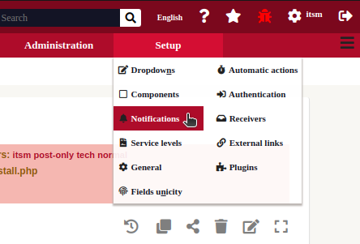

Here you have options and fiels to set.

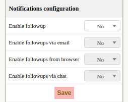

### Enable followups
You need to enable followups to get notification on your chat application.
Enable followups and followups via chat and then save.
You can now see a new tab on the right.

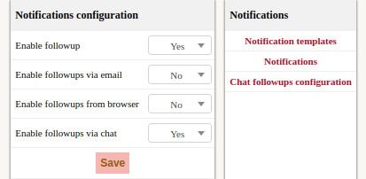

### Configuration of followups
Before manipulate notifications, you must have a incoming webhook url which will get the notification for your chat application.

#### Create incoming webhook with Rocket Chat
***⚠*** *Before doing anything, make sure to have admin rights*

First, go to "Profile icon >> Administration >> Integrations >> New" :

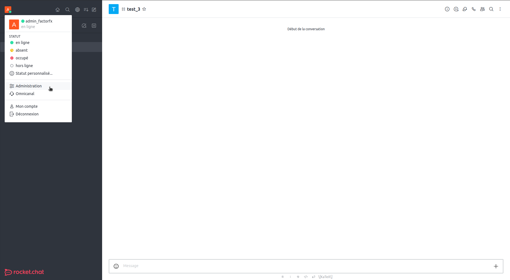

Give a name to you incoming webhook, the channel the application will send the notification, the user who will send the message *(must be a bot)* and save :

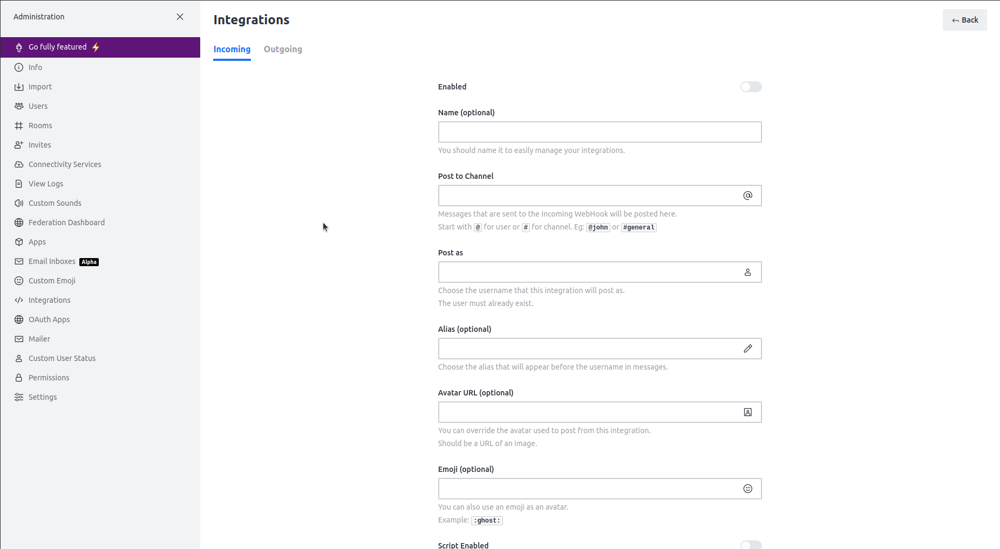

Then click on your new webhook and take the webhook URL : 

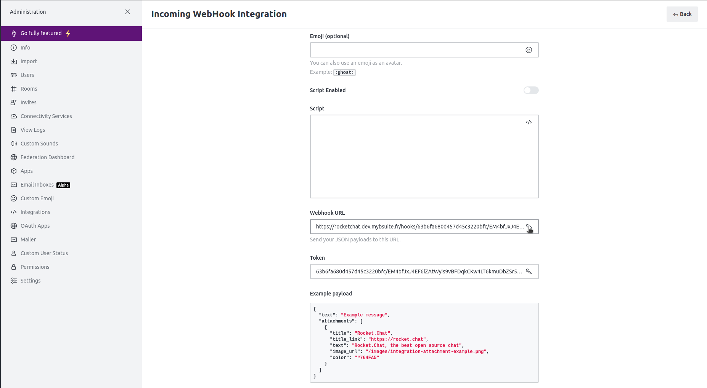

#### Create incoming webhook with Slack
***⚠*** *Before doing anything, make sure to have admin rights*

First, go to "https://api.slack.com/ >> Your apps >> Create an App >> From scratch"

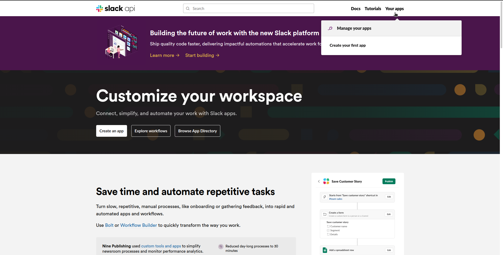

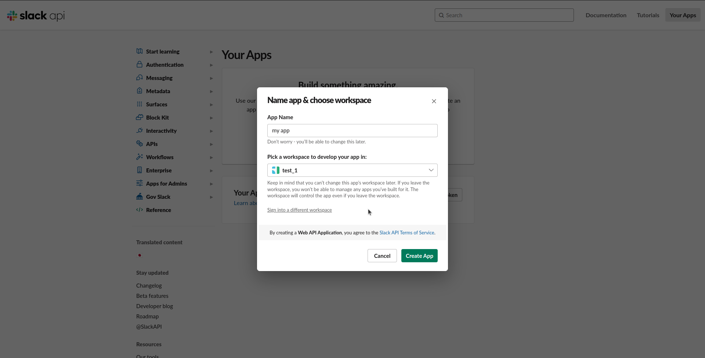

Give a name and choose your worksapce and create the new app.
Then click on "Add features and functionality >> Incoming Webhooks"

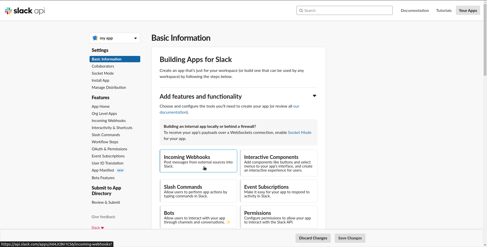

Activate the feature, scroll down and click on "Add new Webhook to Workspace"

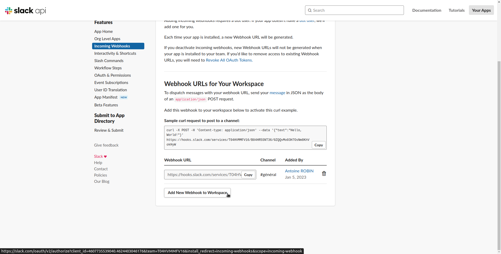

Select the channel you want to welcome notifications and click on Allow button :

Copy the Webhook URL at the end of the page :

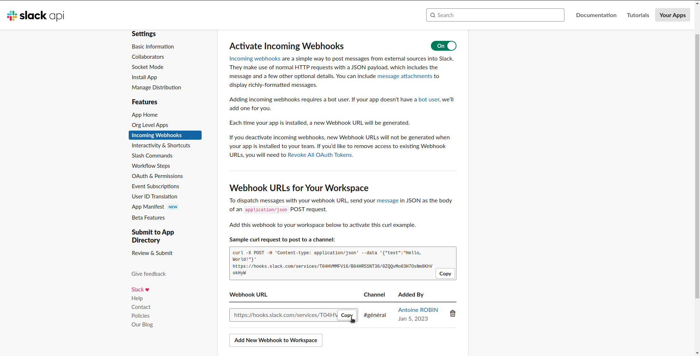

#### Create incoming webhook with Teams
***⚠*** *Before doing anything, make sure to have admin rights*

First, go to "More options >> Connectors"

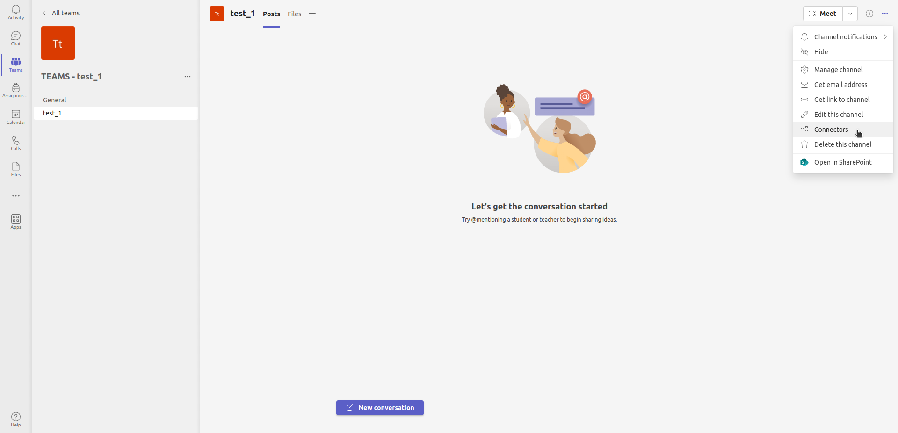

Find "Incoming Webhook" in the research bar and add the connector 

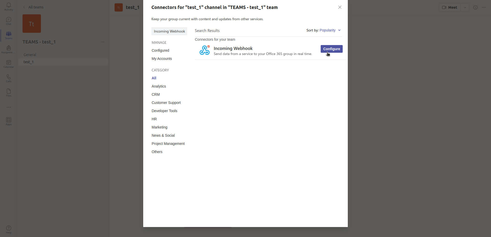

Then you page will be refreshed and the add button will become configure button.
Click on the configure button, give a new name to your webhook and click on "Create".

When it is created, you can see your webhook URL.
Copy it.

### Add a new webhook URL to ITSM-NG
Now you have your webhook URL, go back to ITSM-NG and click on "Chat followups configuration".

In the "Mode" Dropdown, select your chat application. Then, add your webhook URL and save it.

To check if everything is okey, click on the "Test" button. It will send a test notification in your chat application.

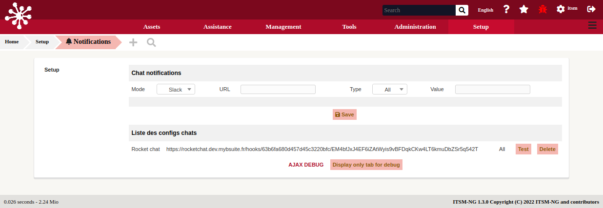

Exemple of test notification :

### How to create new ticket notification
Qurently, we can only create a new ticket notification, so, how to create a new ticket notification ?

Return to "Setup >> Notifications" and select "Notifications"

Search "Ticket" in the research rule :

Go to notifications, there is a notification named "New Ticket", click on it :

Go to "Templates", as you can see all template in ITSM-NG are in the mode "Email". That's why you don't recive any notification on the chat. You need to add the same Template but with the "Chat" mode :
Click on the "Add a template" button, change the "Mode" to "Chat" and the "Notification template" to "Tickets" then add.

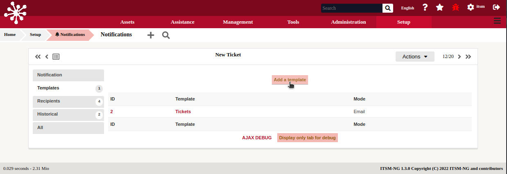

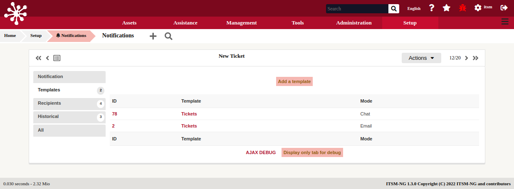

### Enable automatic action to send the notification
Don't forget to what if the automatic action "queuedchat" are sheduled to send the notification.
Go to "Setup >> Automatic actions"

Search "Chat" in the research rule :

Click on "queuedchat" action and change the "Status" to "Scheduled", you can modify the "Run frequency" to send all queuedchat every days for exemple.

