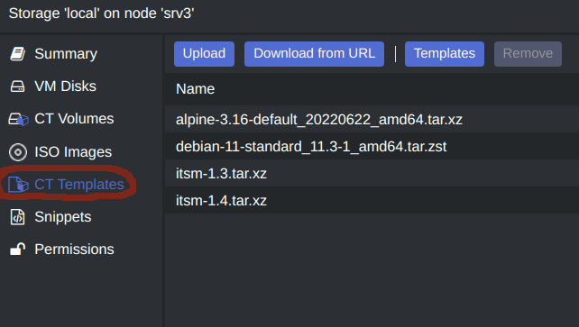
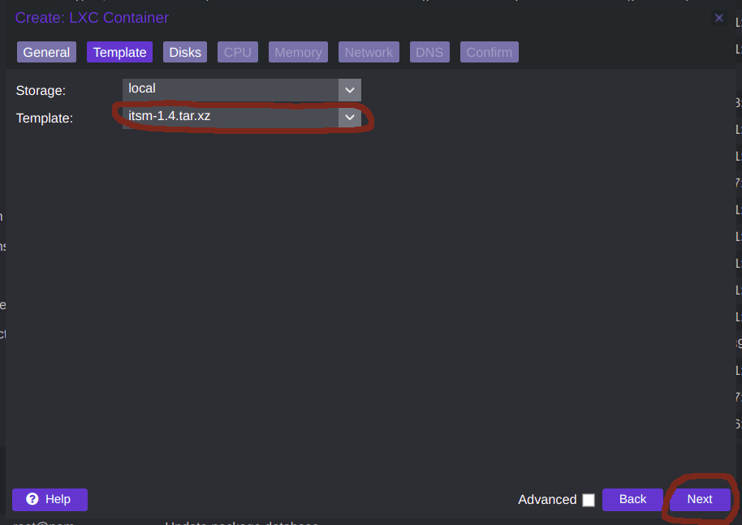
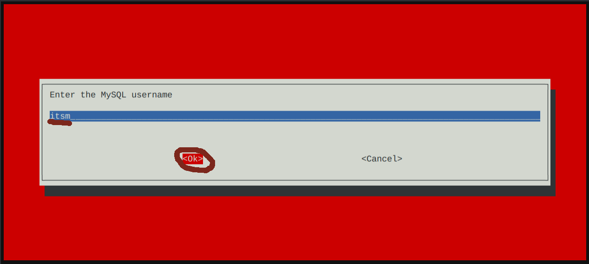
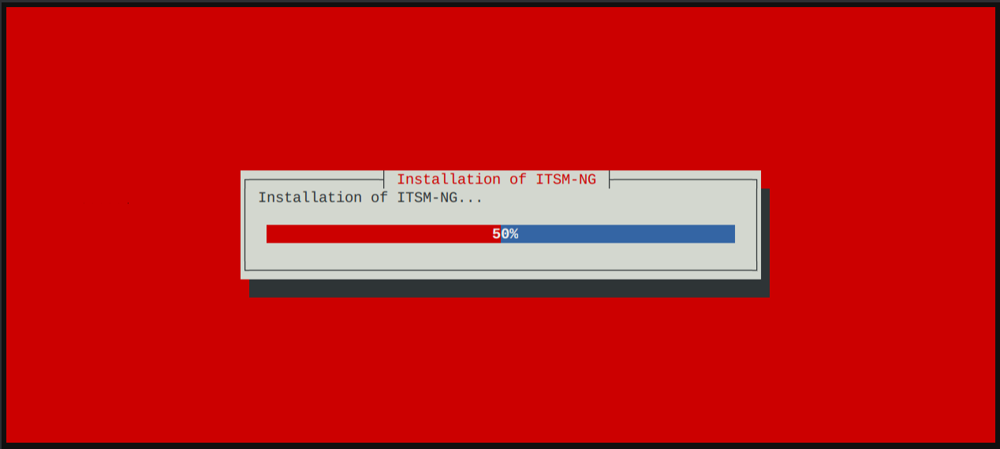

# Install ITSM-NG in LXC container

## Install LXC template in Proxmox

To use the lxc template, you should add the template in your proxmox.

The templates are available on GitHub, you can download them [here](https://github.com/itsmng/itsm-lxc/releases).

Select the LXC template storage

Click on ***CT Modeles***

Click on ***Upload***

Click on ***Select*** and select the lxc template

Click on ***Upload***

Your template is now installed in proxmox, and you can use it to create containers.

## Create LXC container in Proxmox

Select your ITSM-NG LXC template 

Choose how much storage do you allocate to the container

Choose how much processor do you allocate to the container

Choose how much memory do you allocate to the container

Select your network card et chose DHCP or Static address

Write which DNS server your container use

Click on start container now et Finish

Et close the window

Now your container is create and running.

Go to the console, log in with the root user and the password you have defined

Write your MySQL username

Write your MySQL password

Write your database name

Installation can take several minutes

Your ITSM-NG is completely install

Your ITSM-NG is available on http://YOUR_IP/

## Install in other hypervisor
This container can be use in other hypervisor other than Promox. But we do not currently offer an installation guide